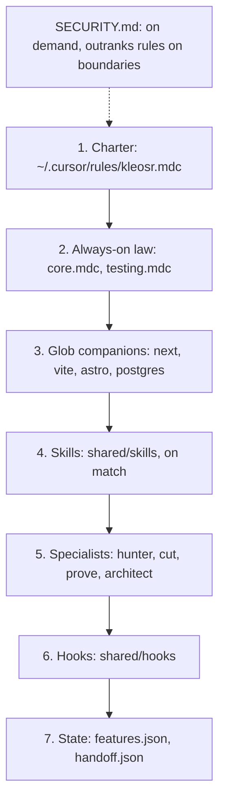

<h1 align="center">bridle</h1>

<p align="center">
  <em>The model supplies judgment. The bridle holds the boundary.</em>
</p>

<p align="center">
  
  
  
  
  
  
</p>

<p align="center">
  <strong>A deterministic engineering harness for Cursor.</strong><br>
  Charter, always-on rules, skills, and three Bash hooks around the host loop. It is not a second agent runtime.
</p>

Verify it before you install it. From Git Bash on Windows, or Bash on macOS and Linux:

```bash
bash tests/run.sh
```

The gauntlet runs in sandboxed fixtures and does not change `~/.cursor`. On 2026-09-15 it recorded **134 passing, 0 failing** ([`docs/host-capability.md`](docs/host-capability.md)). The badge above is the latest `gates` workflow on `master`. A local claim still needs this command and its exit code.

Maintained as private engineering work by kleosr (Mario Pulice), published under the MIT license.

---

## Supported hosts

**Now supports: Claude and Opencode.** Cursor remains the host the three hooks were built for.

| Host | Install | What lands |
|---|---|---|
| Cursor | `bash scripts/install.sh` | Charter, rules, skills, agents, and three hooks in `~/.cursor` |
| Claude Code | `bash scripts/claude.sh install` | Rules, skills, and agents in `~/.claude`. No hooks. |
| opencode | `bash scripts/opencode.sh install` | Instructions, skills, agents, the `bridle` primary agent, and the three hooks via `plugin/bridle.js` in `~/.config/opencode` |

The Cursor hooks bind to that host’s four lifecycle events and its JSON IPC / `failClosed` contract. Rules use Cursor’s instruction hierarchy. Tests and live probes in [`docs/host-capability.md`](docs/host-capability.md) were run on Cursor. Claude and opencode are covered by the port checks (`tests/install_lifecycle.sh`, `TESTS=opencode_port bash tests/run.sh`). Uninstall each port with the same script and `uninstall`.

---

## Install

Requirements: `jq`, and Python 3 or Node.js (the hooks’ JSON codec). On Windows, Git Bash. `jq`: `winget install jqlang.jq` (with `%LOCALAPPDATA%\Microsoft\WinGet\Links` on `PATH`), `brew install jq`, or `apt install jq` / `pacman -S jq`. Cursor, Claude Code, or opencode, matching the host you install.

First install, from this repository:

```bash
bash scripts/install.sh
```

That writes the charter, rules, companions, skills, agents, and hooks into `~/.cursor`. Restart Cursor or start a new chat afterward. A running chat keeps the previous rules.

`FORCE` is the overwrite switch, default off. If a destination already exists and differs, the installer skips it and prints `[warn] skip differing … (FORCE=1)`. A skipped file is not updated. To replace those files, the installer first copies the current file to `*.pre-kleos-bak` (once), then overwrites:

```bash
FORCE=1 bash scripts/install.sh
```

`AGENTS.md` documents `FORCE=1` because an update that skips differing files leaves a partial install.

Remove the install and restore those backups:

```bash
bash scripts/uninstall.sh
```

Cloud Agents load project hooks, not `~/.cursor/hooks.json`. Opt in on another repository. This pack refuses that install into itself.

```bash
CLOUD=1 TARGET_REPO=<other-repo> bash shared/hooks/fleet_sync.sh project-hooks
```

---

## What the hooks change

| Without the gate | With bridle |
|---|---|
| `.env`, `.pem`, `id_rsa`, and credentials can be read into context | `before_read_file.sh` denies those paths before the bytes are returned |
| `rm -rf /`, force-push, `reset --hard`, `curl \| sh` | `before_shell.sh` splits on operators outside quotes and denies them |
| Secret tokens in a prompt (`ghp_`, `sk-`, `AKIA`, private keys) | `before_submit_prompt.sh` blocks transmission (`continue: false`) |
| “Tests passed” with no command | Done is the verifying command and exit `0` |
| `eslint-disable complexity`, `--ignore=C901` from the shell | `before_shell.sh` denies those suppressions |
| The same check failing again with no new evidence | The charter stops the repeat: record the evidence, change the hypothesis, or name the missing input |
| A feature row edited to `passing` | `passing` is only `bash scripts/feature.sh pass <id>` on that tree |

Prompt, shell, and read are fail-closed. If the hook crashes, times out, or returns invalid JSON, Cursor blocks the action. `stop` is the exception, below.

---

## Layers

Load order. Each layer is narrower than the one above it. [`SECURITY.md`](SECURITY.md) is read on demand and outranks the rules on a boundary question.



1. **Charter.** `shared/rules/charter.txt`, installed as `~/.cursor/rules/kleosr.mdc` with `alwaysApply`. Identity, what may proceed without asking, and what needs approval. Install it only there. A second copy in Cursor Settings → User Rules drifts.
2. **Always-on law.** `core.mdc` and `testing.mdc`, each capped at 80 lines. Craft, size, the dependency ladder, and the verify loop.
3. **Glob companions.** Framework rules attach on file match and stay inert unless that package’s manifest names the dependency.
4. **Skills.** Catalog `shared/config/skills.txt`. Procedures only. They cannot grant a permission.
5. **Specialists.** `hunter`, `cut`, `prove`, and `architect` run in a separate context. `prove` checks evidence so the implementing model does not grade its own change; `architect` reviews a design before code.
6. **Hooks.** The table below. Registered in `~/.cursor/hooks.json`.
7. **State.** `shared/config/features.json` is the capability ledger. `state/handoff.json` is gitignored continuity for the next session. Continuity is not a new assignment.

### Hooks

| Event | Script | Verdict |
|---|---|---|
| `beforeSubmitPrompt` | `before_submit_prompt.sh` | Fail closed. `continue: false` on secret tokens. |
| `beforeShellExecution` | `before_shell.sh` | Fail closed. `permission: deny` on destructive calls, secret reads, lint suppressions, and shell rewrites of source. `ask` on infra and database changes. |
| `beforeReadFile` | `before_read_file.sh` | Fail closed. Canonical path, then deny `.env`, private keys, and certificates. |

There is no `stop`, `sessionStart`, `preToolUse`, or `updated_input`. The frozen set is [`docs/ARCHITECTURE.md`](docs/ARCHITECTURE.md). False completion of a feature is a failed `feature.sh pass`.

### Shell-hook timing

Matching in `shell_gate.sh`, `common.sh`, and `sql_scope.sh` stays inside Bash (`[[ =~ ]]`). On Windows Git Bash, a pipeline of `grep` / `sed` / `tr` cost about 50 ms per spawn. A 30-segment command took **45.0 s** and Cursor killed it (`exit code 1` under `failClosed`). After the in-process rewrite the same command took **3.2 s** end to end through the PowerShell shim. Measured 2026-09-15 on Cursor 3.20.15, Windows 11. Numbers and the probe log: [`docs/host-capability.md`](docs/host-capability.md).

`git-bash-shim.ps1` compiles `~/.cursor/hooks/KleosPipeUtil.dll` once, maps Windows paths in PowerShell, and uses timeouts of 30 s (read, submit) and 60 s (shell).

---

## For agents in this repository

Claude, Devin, Cursor agents, and any other coding agent:

1. Read `AGENTS.md` before editing. Read `SECURITY.md` before security-sensitive work.
2. Run `bash tests/run.sh`, or the narrowest suite that can falsify the change (`TESTS=<name> bash tests/run.sh`). Cite the command and the exit code.
3. Keep the three hook events. Do not add a host adapter, a second installer, or a partial port in an ordinary task.
4. `features.json` and `state/handoff.json` do not authorize a new goal or a new host.
5. On Windows, run these scripts from Git Bash.

`bash scripts/ready.sh` checks the bootstrap contract. `DOCTOR_SKIP_LIVE=1 bash scripts/doctor.sh` checks the repository. `bash scripts/doctor.sh` also checks the live `~/.cursor` install. `bash scripts/eval.sh check` and `bash scripts/feature.sh check` check coverage and ledger invariants.

---

## Layout

| Path | Role |
|---|---|
| `AGENTS.md` | Map the agent reads first |
| `SECURITY.md` | Security boundary |
| `shared/rules/` | Charter source, always-on rules, glob companions |
| `shared/skills/` | Skill bodies |
| `shared/agents/` | `hunter`, `cut`, `prove`, `architect` |
| `shared/hooks/` | Event scripts, `git-bash-shim.ps1`, `lib/`, `policy/` |
| `shared/config/` | `harness.json`, `features.json`, `skills.txt` |
| `scripts/` | `install.sh`, `uninstall.sh`, `doctor.sh`, `ready.sh`, `eval.sh`, `feature.sh`, `handoff.sh` |
| `tests/` | Gauntlet |
| `docs/` | Architecture, toolchain, host capability |

Further reading: [`docs/ARCHITECTURE.md`](docs/ARCHITECTURE.md), [`docs/TOOLCHAIN.md`](docs/TOOLCHAIN.md), [`docs/host-capability.md`](docs/host-capability.md).
