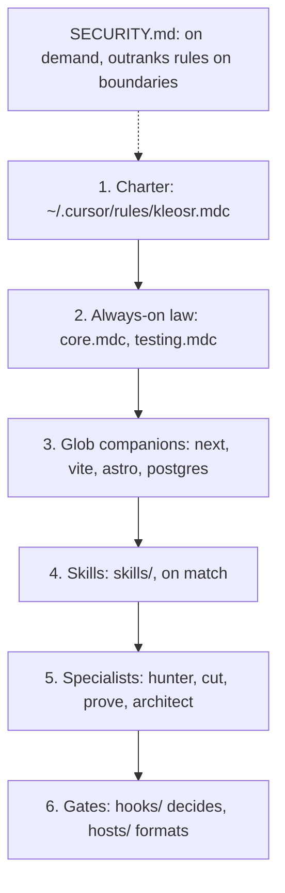

<h1 align="center">bridle</h1>

<p align="center">
  <em>The model supplies judgment. The bridle holds the boundary.</em>
</p>

<p align="center">
  
  
  
  
  
</p>

<p align="center">
  <strong>A deterministic engineering harness for coding agents.</strong><br>
  Charter, always-on rules, skills, and three Bash gates around the host loop. It is not a second agent runtime.
</p>

Verify it before you install it. From Git Bash on Windows, or Bash on macOS and Linux:

```bash
bash tests/run.sh
```

The gauntlet runs in sandboxed fixtures and does not touch your home directory. The badge is the latest `gates` workflow on `master`; a local claim still needs this command and its exit code.

Maintained as private engineering work by kleosr (Mario Pulice), published under the MIT license.

---

## Install

Requirements: `jq`, Node.js (the gates' JSON codec), and on Windows, Git Bash. `jq`: `winget install jqlang.jq`, `brew install jq`, or `apt install jq` / `pacman -S jq`.

| Host | Command | What lands |
|---|---|---|
| Cursor | `bash hosts/cursor/install.sh` | Charter, rules, skills, agents, and the three gates in `~/.cursor` |
| Claude Code | `bash hosts/claude/install.sh` | Rules, skills, agents, the three gates, and the Write and Stop hooks in `~/.claude` |
| opencode | `bash hosts/opencode/install.sh` | Instructions, skills, agents, the `bridle` primary agent, and the gates via `plugin/bridle.js` in `~/.config/opencode` |

Each installer takes `install` (default) or `uninstall`; Cursor also takes `verify`, `all`, and `project-hooks`. Restart the host or start a new chat afterward.

`FORCE=1` is the overwrite switch, default off. A destination that already exists and differs is skipped with `[warn] skip differing … (FORCE=1)`. With `FORCE=1` the installer first copies it to `*.pre-kleos-bak` (once), then overwrites; `uninstall` restores those backups.

Cursor Cloud Agents load project hooks, not `~/.cursor/hooks.json`. Opt in on another repository (never this one):

```bash
TARGET_REPO=<other-repo> bash hosts/cursor/install.sh project-hooks
```

---

## What the hooks change

| Without the gate | With bridle |
|---|---|
| `.env`, `.pem`, `id_rsa`, and credentials can be read into context | `before_read_file.sh` denies those paths before the bytes are returned |
| `rm -rf /`, force-push, `reset --hard`, `curl \| sh` | `before_shell.sh` splits on operators outside quotes and denies them |
| Secret tokens in a prompt (`ghp_`, `sk-`, `AKIA`, private keys) | `before_submit_prompt.sh` blocks transmission (`continue: false`) |
| “Tests passed” with no command | Done is the verifying command and exit `0` |
| `eslint-disable complexity`, `--ignore=C901` from the shell | `before_shell.sh` denies those suppressions |
| The same check failing again with no new evidence | The charter stops the repeat: record the evidence, change the hypothesis, or name the missing input |

Prompt, shell, and read are fail-closed: if a gate crashes, times out, or returns invalid output, the host blocks the action.

---

## Layers

Load order. Each layer is narrower than the one above it. [`SECURITY.md`](SECURITY.md) is read on demand and outranks the rules on a boundary question.


```mermaid
graph TD
  A["1. Charter: ~/.cursor/rules/kleosr.mdc"] --> B["2. Always-on law: core.mdc, testing.mdc"]
  B --> C["3. Glob companions: next, vite, astro, postgres"]
  C --> D["4. Skills: skills/, on match"]
  D --> E["5. Specialists: hunter, cut, prove, architect"]
  E --> F["6. Gates: hooks/ decides, hosts/ formats"]
  H["SECURITY.md: on demand, outranks rules on boundaries"] -.-> A
```

1. **Charter.** `rules/charter.txt`, installed once per host (Cursor: `~/.cursor/rules/kleosr.mdc` with `alwaysApply`). Identity, what may proceed without asking, and what needs approval. A second copy in Cursor Settings → User Rules drifts.
2. **Always-on law.** `core.mdc` and `testing.mdc`, each capped at 80 lines. Craft, size, the dependency ladder, and the verify loop.
3. **Glob companions.** Framework rules attach on file match and stay inert unless that package’s manifest names the dependency.
4. **Skills.** Listed in `hosts/manifest.json`. Procedures only. They cannot grant a permission.
5. **Specialists.** `hunter`, `cut`, `prove`, and `architect` run in a separate context. `prove` checks evidence so the implementing model does not grade its own change; `architect` reviews a design before code.
6. **Gates.** The table below. `hooks/` decides; each host's `hosts/<host>/verdict.sh` turns the decision into that host's format.

### Gates

| Cursor event (Claude Code) | Script | Verdict |
|---|---|---|
| `beforeSubmitPrompt` (`UserPromptSubmit`) | `before_submit_prompt.sh` | Fail closed. Blocks secret tokens. |
| `beforeShellExecution` (`PreToolUse` Bash) | `before_shell.sh` | Fail closed. Denies destructive calls, secret reads, lint suppressions, and shell rewrites of source. Asks on infra and database changes. |
| `beforeReadFile` (`PreToolUse` Read) | `before_read_file.sh` | Fail closed. Canonical path, then deny `.env`, private keys, and certificates. |

Cursor registers no `stop`, `sessionStart`, `preToolUse`, or `updated_input`. The frozen set is [`docs/architecture.md`](docs/architecture.md).

### Shell-hook timing

Matching in `shell_gate.sh`, `common.sh`, and `sql_scope.sh` stays inside Bash (`[[ =~ ]]`). On Windows Git Bash, a pipeline of `grep` / `sed` / `tr` cost about 50 ms per spawn. A 30-segment command took **45.0 s** and Cursor killed it (`exit code 1` under `failClosed`). After the in-process rewrite the same command took **3.2 s** end to end through the PowerShell shim. Measured 2026-09-15 on Cursor 3.20.15, Windows 11. Numbers and the probe log: [`docs/host-capability.md`](docs/host-capability.md).

`git-bash-shim.ps1` compiles `~/.cursor/hooks/KleosPipeUtil.dll` once, maps Windows paths in PowerShell, and uses timeouts of 30 s (read, submit) and 60 s (shell).

---

## For agents in this repository

Claude, Devin, Cursor agents, and any other coding agent:

1. Read `AGENTS.md` before editing. Read `SECURITY.md` before security-sensitive work.
2. Run `bash tests/run.sh`, or the narrowest suite that can falsify the change (`TESTS=<name> bash tests/run.sh`). Cite the command and the exit code.
3. Keep the three gate events. Do not add a host adapter, a second installer, or a partial port in an ordinary task.
4. A handoff file does not authorize a new goal or a new host.
5. On Windows, run these scripts from Git Bash.

---

## Layout

| Path | Role |
|---|---|
| `AGENTS.md` | Map the agent reads first |
| `SECURITY.md` | Security boundary |
| `rules/` | Charter, always-on rules, glob companions |
| `skills/` | Skill bodies |
| `agents/` | `hunter`, `cut`, `prove`, `architect` |
| `hooks/` | The three gates: entry scripts, `lib/`, `policy/` |
| `hosts/` | `manifest.json` (what ships), `lib.sh` (shared installer code), and `cursor/`, `claude/`, `opencode/`, each with `install.sh` and `verdict.sh` |
| `tests/` | `run.sh` gauntlet; fixtures in `gate/`, `hosts/`, `pack/` |
| `scripts/`, `evals/` | `scope_eval.sh` and its fixtures: scores a live agent against the scope law |
| `docs/` | Architecture, host capability log |

Further reading: [`docs/architecture.md`](docs/architecture.md), [`docs/host-capability.md`](docs/host-capability.md).
